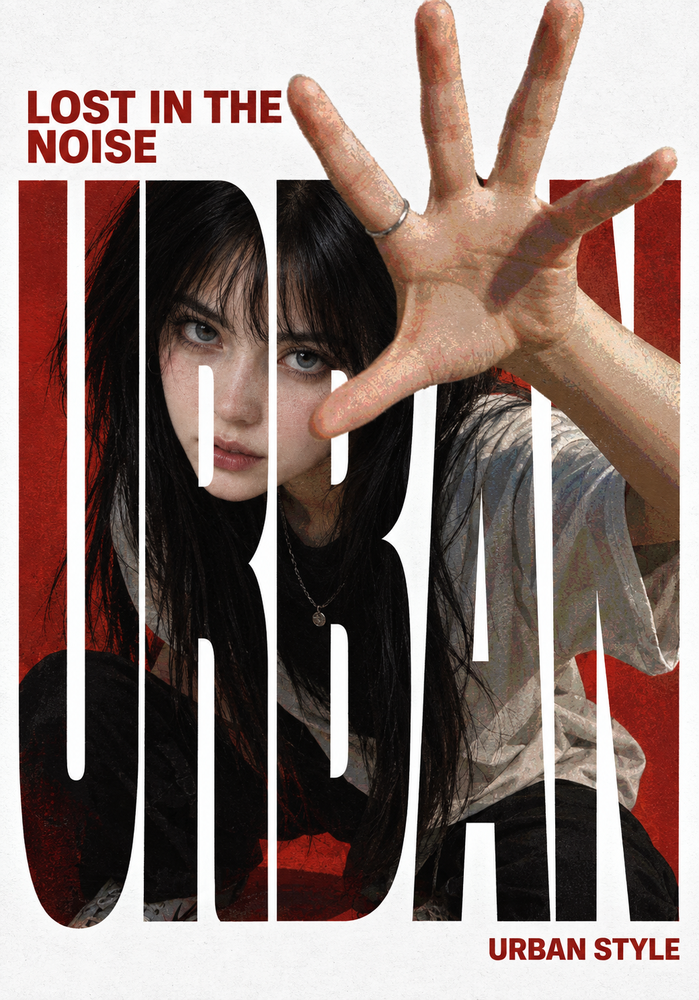

# QC-Reframe


**选中网页图片 → Codex 逆向提示词 → 按需生成新图片。**

当前版本 **0.1.18**。一个与本机 Codex 协作的 Chrome MV3 扩展，支持网页图片悬浮选取、主体上传、项目记录与版本管理。不需要填写模型 API Key；沿用你的 Codex 登录和额度。可在连接设置中单独选择并验证插件模型，不修改 Codex 全局模型。

- **提取风格**：提取通用风格，或保留你的主体结构，仅转换画法。
- **完整复刻**：分析参考图的内容、构图和视觉表现。
- **主体重演**：以你的主体重演参考图，任务指令可编辑。
- **继续生图**：把生成的提示词交给 Codex 的 imagegen，结果保存在本机。当前源码的完整复刻使用纯文生图；风格转换和主体重演附带主体图与参考图。

## 界面与效果


界面截图来自更名前的 0.1.16，展示已保存的「短发回眸暖金水彩肖像」结果；截图使用本地展示数据，未重新调用模型。

<table>
  <tr>
    <td width="25%" valign="top"><a href="browser-extension/docs/gallery/urban-poster/README.md"></a><br /><a href="browser-extension/docs/gallery/urban-poster/README.md">都市海报 · 主体重演</a></td>
    <td width="25%" valign="top"><a href="browser-extension/docs/gallery/watercolor-portrait/README.md"></a><br /><a href="browser-extension/docs/gallery/watercolor-portrait/README.md">水彩肖像 · 主体重演</a></td>
    <td width="25%" valign="top"><a href="browser-extension/docs/gallery/watercolor-mug/README.md"></a><br /><a href="browser-extension/docs/gallery/watercolor-mug/README.md">陶瓷杯 · 提取风格</a></td>
    <td width="25%" valign="top"><a href="browser-extension/docs/gallery/red-mecha/README.md"></a><br /><a href="browser-extension/docs/gallery/red-mecha/README.md">红白机甲 · 主体重演</a></td>
  </tr>
</table>

**[查看完整画廊 →](browser-extension/docs/gallery/README.md)** 每例均附主体原图、参考模板和可复制的 Prompt。前三例在插件中发起生图，红白机甲案例在独立 Codex 会话中生成。

## 让 Codex 帮你安装

在 **Codex 桌面 App 的本地聊天**里复制发送下面这段话：

```text
请帮我安装并启动 QC-Reframe 0.1.18：
https://github.com/AIDiscovery007/qc-reframe

请获取仓库的 v0.1.18 标签，先阅读 browser-extension/docs/INSTALL_WITH_CODEX.md，
先确认插件实际使用的本机 Codex CLI 已更新到最新版本，再完成环境检查、初始化、构建、本机服务启动和配对准备，
优先在我的 Codex 内置浏览器里使用。能自动完成的步骤请直接完成。
需要我登录或在浏览器界面确认加载扩展时，再给我准确的文件路径和最短操作步骤。
不要覆盖已有安装、项目记录或 Codex 全局配置。
完成后打开 Pinterest，让我能点击图片上的“逆向风格”开始使用。
请分别说明服务、扩展加载、配对是否已实际验证，尚未完成的步骤不要标为完成。
```

Codex 会运行仓库内的初始化和启动脚本。**首次安装扩展、登录和浏览器权限确认可能需要你手动完成**；扩展管理入口因客户端版本而异。Codex 内置浏览器已在开发环境验证过，不保证每个客户端或受管账号都开放第三方扩展加载。没有对应入口时可使用 Chrome。

## 自己安装

需要 Git、Node.js **22.15+**、已安装并登录的 Codex CLI，以及可加载 Chrome MV3 扩展的浏览器。首发在 macOS 验证；其他系统尚未实测。生图额外需要本机 `imagegen` skill 和账户支持的内置生图能力。

**请单独将本机 Codex CLI 更新到最新版本。** 更新桌面 App 不代表 CLI 已更新；旧 CLI 可能缺少新模型。更新后重启本机服务、刷新模型列表，可用性以账号权限和实际验证为准。[CLI 更新说明](https://learn.chatgpt.com/docs/codex/cli)

```bash
git clone --branch v0.1.18 --single-branch https://github.com/AIDiscovery007/qc-reframe.git
cd qc-reframe/browser-extension
npm run setup
npm start
npm run pair
```

`setup` 检查环境、安装锁定依赖并构建；`start` 将服务启动到后台，重复运行会复用同一版本服务和配对码。将 `.output/chrome-mv3` 加载为已解压扩展，或在支持 ZIP 的客户端导入 [Release 的 Chrome ZIP](https://github.com/AIDiscovery007/qc-reframe/releases/tag/v0.1.18)。在 QC-Reframe 设置粘贴 `pair` 输出的本机配对码，选择插件模型并点击「验证并使用」，再刷新网页。

**首次必须获取完整仓库**，其中包含 bridge 和 Alchemy skill。Chrome ZIP 只包含浏览器端，不包含本机服务。

## 日常使用

1. 在网页图片上点击「逆向风格」，打开参考模板项目。
2. 选择「提取风格」「完整复刻」或「主体重演」；按需上传主体图、编辑任务指令，然后生成提示词。
3. 复制提示词，或点击「用 Codex 生成图片」。提示词与生成结果按项目和路径分别保存，可从「项目记录」继续使用。

在 `browser-extension` 目录管理本机服务：

| 命令 | 用途 |
| --- | --- |
| `npm start` | 启动或复用后台服务 |
| `npm run status` | 查看连接、版本及运行中的任务数 |
| `npm run doctor` | 检查 CLI 登录、Alchemy 和 imagegen skill |
| `npm run pair` | 显示配对码，仅粘贴到本机插件设置 |
| `npm stop` | 停止后台服务，保留项目与配对码；任务进行中会拒绝停止 |
| `npm run bridge` | 前台运行，适合查看日志或排查问题 |

后台服务不等于开机自启，电脑重启后运行 `npm start`。升级前先完成或取消任务，再停止旧服务、更新文件、重新构建并启动，最后重新加载扩展和刷新网页。

## 数据与能力边界

图片、提示词、生成结果、配对码及本机配置统一留在 `browser-extension/.local/`，当前源码按图片、记录、配置、日志和临时状态分目录收纳，不提交 Git；`docs/gallery/` 单独收录本页选定的公开演示案例。服务仅监听 `127.0.0.1:43187`，需要配对码。调用本机 Codex 不等于离线推理，图片会按你的 Codex 配置交给模型处理。首次安装不会自动提交图片或消耗生图额度。

悬浮按钮按网页控件位置动态避让；复杂 canvas、跨域 iframe 或被遮挡的图片不保证支持。没有安全空位时可用图片右键入口。逆向结果是近似复刻或风格迁移方案，不保证还原原始 Prompt 或逐像素一致。

- [完整安装步骤与排错](browser-extension/docs/INSTALL_WITH_CODEX.md)
- [使用方法与开发说明](browser-extension/README.md)
- [贡献与维护指南](Contribution.md)
- [更新日志](browser-extension/docs/releases/README.md)
- [下载 0.1.18](https://github.com/AIDiscovery007/qc-reframe/releases/tag/v0.1.18)
