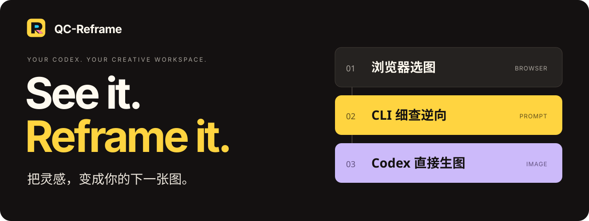

**在 Codex 内置浏览器里选图，用本机 Codex CLI 逆向提示词，再让 Codex 直接生图。**

从单图细查到多图编排，把收集、逆向、生成和本机管理连成一条创作流程。沿用你的 Codex 登录与额度，无需另外填写模型 API Key。

**[开始使用 ↗](browser-extension/docs/INSTALL_WITH_CODEX.md)**　 /　 [功能导览](browser-extension/docs/FEATURES.md)　 /　 [效果画廊](browser-extension/docs/gallery/README.md)　 /　 [v0.1.24 · 下载](https://github.com/AIDiscovery007/qc-reframe/releases/tag/v0.1.24)

## 看见参考，做出自己的版本

保留你的主体，让参考图提供构图、姿态与视觉语言。

| 01 · 你的主体 | 02 · 参考模板 | 03 · Codex 生成 |
| :---: | :---: | :---: |
|  |  |  |

**[都市海报 · 查看完整 Prompt →](browser-extension/docs/gallery/urban-poster/README.md)**　插件内逆向，并调用 Codex imagegen 生成。

更多风格：[水彩肖像](browser-extension/docs/gallery/watercolor-portrait/README.md) · [水彩陶瓷杯](browser-extension/docs/gallery/watercolor-mug/README.md) · [完整画廊](browser-extension/docs/gallery/README.md)

## 创作需要的，都接上了

| Codex 驱动 | 从灵感到成图 | 本机工作流 |
| :--- | :--- | :--- |
| **[Codex 全流程](browser-extension/docs/FEATURES.md#codex-全流程)** 内置浏览器选图，CLI 直接交互，Codex 内置工具直接生图。 | **[单图到多图](browser-extension/docs/FEATURES.md#单图到多图)** 四条创作路径；2–6 张主体配合参考模板，编排后融合生图。 | **[多任务并行](browser-extension/docs/FEATURES.md#多任务并行)** 多个逆向与生图任务同时推进，独立查看进度、取消和取回结果。 |
| **[先放大细看，再写词](browser-extension/docs/FEATURES.md#先放大细看再写词)** 内置 Alchemy skill，整图定位、局部放大、细节核查与整图回看。 | **[浮窗三种入口](browser-extension/docs/FEATURES.md#浮窗三种入口)** 立即逆向、先加入再逆向，或直接打开工作台。 | **[图片直接在本机打开](browser-extension/docs/FEATURES.md#图片直接在本机打开)** 复制图片路径；macOS 一键打开图片、在 Finder 定位。 |
| **[CLI 版本探针](browser-extension/docs/FEATURES.md#cli-版本探针)** 检测实际版本与安装来源，支持的安装方式可一键升级。 | **[图片方向就地调整](browser-extension/docs/FEATURES.md#图片方向就地调整)** 预览中旋转、应用，直接用于后续逆向与生图，省去下载再上传。 | **[成果留在本机](browser-extension/docs/FEATURES.md#成果留在本机)** 图片、提示词、项目记录与日志存入本机目录，随时继续创作。 |

## 小浮窗起步，工作台继续

轻量选图，宽屏编排。项目、提示词版本和生成记录贯通，关闭面板后任务仍继续运行。

*v0.1.23 示例界面，使用公开画廊素材，展示简洁的创作工作台。[工作台与更多功能截图 →](browser-extension/docs/FEATURES.md)*

## 开始你的第一张图

**[把安装交给 Codex →](browser-extension/docs/INSTALL_WITH_CODEX.md#让-codex-帮你安装)**　复制安装指令，完成环境检查、本机服务启动与浏览器配对。也可按同页步骤手动安装。

需要已登录的 Codex CLI、Node.js 22.15+ 和可加载 MV3 扩展的浏览器。已在 macOS 的 Codex 内置浏览器验证，也保留 Chrome 使用路径；生图需账户支持内置生图能力。**首次安装需要完整仓库，Release 中的 Chrome ZIP 仅含浏览器端。**

| 想做什么 | 从这里开始 |
| :--- | :--- |
| 安装、升级或排错 | [安装指南](browser-extension/docs/INSTALL_WITH_CODEX.md) |
| 了解功能与创作路径 | [功能导览](browser-extension/docs/FEATURES.md) |
| 找效果、参考图与可复制的 Prompt | [效果画廊](browser-extension/docs/gallery/README.md) |
| 查询操作细节与开发命令 | [使用手册](browser-extension/README.md) · [贡献指南](Contribution.md) |
| 查看版本变化 | [更新日志](browser-extension/docs/releases/README.md) · [Releases](https://github.com/AIDiscovery007/qc-reframe/releases) |

本机保存，模型按你的 Codex 配置调用；不代表离线推理。逆向用于近似复刻与风格迁移，不保证恢复原始 Prompt。浏览器扩展支持与其他使用边界见[安装指南](browser-extension/docs/INSTALL_WITH_CODEX.md)及[使用手册](browser-extension/README.md#图片与数据)。
