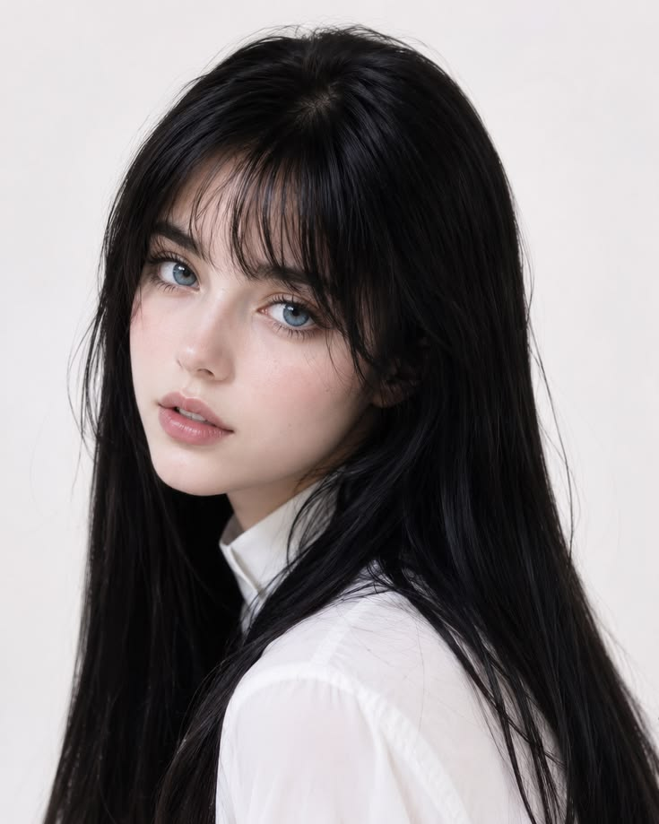
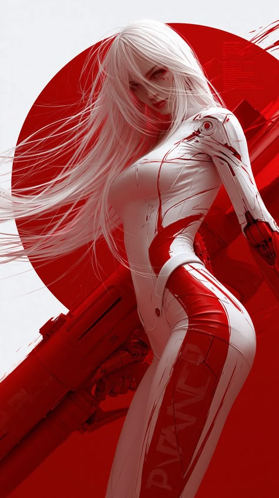

# 红白机甲人物重演

[← 返回画廊](../README.md)

**主体重演** · 以黑发人物为主体，重演参考中的姿态、机械装甲、红色圆形和斜向构图。

使用插件逆向的提示词，在独立 Codex 会话中调用 imagegen 生成。

<table>
  <tr><th width="33%">图 1 · 主体原图</th><th width="33%">图 2 · 参考模板</th><th width="33%">生成结果</th></tr>
  <tr>
    <td valign="top"><a href="subject.jpg"></a></td>
    <td valign="top"><a href="reference.png"></a></td>
    <td valign="top"><a href="result.png"></a></td>
  </tr>
</table>

<details>
<summary>查看完整 Prompt（中文）</summary>

```text
以图1作为唯一主体身份参考，以图2作为原始模板，重演图2的内容关系、构图、裁切、机位、整体姿态、视线、表情、遮挡、服装道具、光影配色与分区域材质。将图2的主要人物替换为图1的人物，身份特征随模板的新视角和动作重新表现。

保留图1的浅肤色、收窄的椭圆脸型、柔和下颌、小巧鼻部、蓝灰色眼睛、饱满粉色嘴唇，以及黑色长直发和疏薄刘海。根据低头、侧倾和转身重新绘制五官透视与发际关系，眼睛颜色仅在实际露出的虹膜中显现。黑发保持本色，重新梳理为被风吹向画面左侧的长发束；刘海随风分离，部分细发丝横过眼眉、鼻梁和嘴部。服装采用图2的白色贴身机械装甲与红色拼接结构。

采用接近9:16的竖幅海报构图，略带低机位观感，人物占据大部分画高，头顶接近上缘，下缘裁至大腿，不显示足部。人物躯干位于中央偏右，胸廓略朝画面左侧转，骨盆更偏侧向，髋部向右突出，收窄腰部连接胸廓与骨盆，形成连贯的S形轮廓。画面右侧肩部较高并靠近观者，同侧装甲手臂沿右缘向右下伸展，末端由画框裁切；另一侧肢体保持模板中的遮挡关系，不新增清晰展示的持握动作。头颈承接倾斜肩线，下巴略收，头向画面左侧低倾，眼睛从发丝下朝观者投来冷静、警觉的目光，嘴唇轻合。头发大幅飘向左侧并越出画框。巨大鲜红圆形置于头肩后方，右缘超出画面；红色大型科幻枪械状机械长物位于人物后方，从左下斜向右上，局部被身体遮住，和下部红色斜切块面共同构成背景动线。

背景露出的区域为冷白至极浅灰，红色圆形与下部色块保持大面积高饱和红。白色装甲由宽阔柔亮面、灰红色转折阴影和局部锐利高光塑形，红色反射集中在面部暗侧、发束内侧、腰部与装甲交界处，不将全部白色区域染成粉红。黑发内部保留深黑体积，以细窄的银灰高光和少量红色反光分开飘散发束，维持模板的丝状层次；发丝遮住部分五官，但露出足以辨认图1脸型、鼻唇和眼部的片段。人物遮挡圆形和斜向机械物，头发又覆盖人物面部、胸前及部分圆形。

视觉焦点落在画面上部的面容、发丝间露出的眼睛与画面右上方的亮白肩甲。用黑发衬托浅色脸部和肩甲，以肩部圆形机械关节、胸腰白色弧面作为次级细节焦点；保持背景机械物较低的细节对比。

整体采用精细写实的科幻数字插画与平面海报结合的表现。皮肤以柔和连续的明暗过渡塑形，鼻唇和眼周带克制的红色环境染色；黑发以细密、方向明确的长线束表现。白色肩臂装甲呈硬质光滑涂层外观，带分段壳体、圆形关节、细接缝和少量红色划痕；胸腰处贴体白色表面保持连续曲面。髋侧、大腿与肘部的红色拼接区域更有光泽，局部保留沿动作压缩的细褶。背景以硬边红色几何为主，边缘少量斜向刷痕和拉丝线。腿部可保留低对比、局部裁切的浅色标记形状，但不编造可读单词。
```

</details>

<details>
<summary>Codex 交给 imagegen 的整理版指令</summary>

```text
Use case: identity-preserve
Asset type: 精细写实科幻数字插画与平面海报，接近9:16竖幅。
Input images: 图1是唯一人物身份参考；图2是原始模板，决定所有内容关系、构图、裁切、机位、整体姿态、视线、表情、遮挡、服装道具、光影配色与分区域材质。将图2主要人物替换为图1人物，不能沿用图2的脸或白发。身份随模板的新视角动作重新表现，不直接粘贴图1的头部角度。
Subject: 保留图1浅肤色、收窄椭圆脸型、柔和下颌、小巧鼻部、蓝灰眼睛、饱满粉色嘴唇、黑色长直发、疏薄刘海。按低头、侧倾、转身重新绘制五官透视与发际关系。虹膜实际露出部分才呈蓝灰色。黑发保持深黑，长发束被风大幅吹向画面左侧并越出边框；刘海随风分离，细发丝横过眼眉、鼻梁与嘴部，仍露出可辨认图1脸型鼻唇眼部的片段。
Composition: 严格重演图2。略低机位，人物占大部分画高，头顶接近上缘，下缘裁至大腿，无足部。躯干中央偏右，胸廓略朝画面左转，骨盆更偏侧向，髋部向右突出，收窄腰部连接胸廓骨盆形成连贯S形。画面右肩较高且靠近观者，该侧装甲手臂沿右缘向右下伸展，末端被画框裁切。另一肢体保持模板遮挡，不新增清晰持握动作。头颈承接斜肩线，下巴略收，头向画面左侧低倾，从发丝下冷静警觉看向观者，嘴唇轻合。
Scene: 巨大鲜红圆形位于头肩后方，右缘越出画面。红色大型科幻枪械状机械长物在人物后方，由左下斜向右上，部分被身体遮挡，和下部红色斜切块面构成背景动线。人物遮挡圆形与斜向机械物，头发覆盖部分面部、胸前和圆形。背景露出区域冷白至极浅灰。背景机械物维持较低细节对比。
Clothing/materials: 图2白色贴身机械装甲和红色拼接结构。白色肩臂装甲硬质光滑涂层，分段壳体、圆形关节、细接缝、少量红划痕；胸腰贴体白表面为连续曲面。髋侧、大腿、肘部红色拼接更光泽，并有沿动作压缩的细褶。腿部只允许低对比局部裁切浅色标记形状，不编造可读文字。
Light/palette: 高饱和大面积红圆和红几何色块。白装甲以宽阔柔亮面、灰红转折阴影、局部锐利高光塑形；保留亮白而非整体染粉。红反射集中面部暗侧、发束内侧、腰部与装甲交界。皮肤柔和连续明暗，鼻唇眼周克制红环境染色。黑发内部保持深黑体积，以细窄银灰高光、少量红反光区分细密方向明确的丝状长发束，保持模板层次。
Focus: 上部面容、发丝间眼睛、右上亮白肩甲是主要焦点；深黑头发衬托浅脸与肩甲。肩圆形机械关节及胸腰白弧面为次级焦点。背景硬边红几何，边缘少量斜刷痕和拉丝线。
Constraints: 尽量忠实图2原始布局与姿态，唯人物身份取图1；无新增人物、无新增可见持握动作、无文字、无水印。
```

</details>
