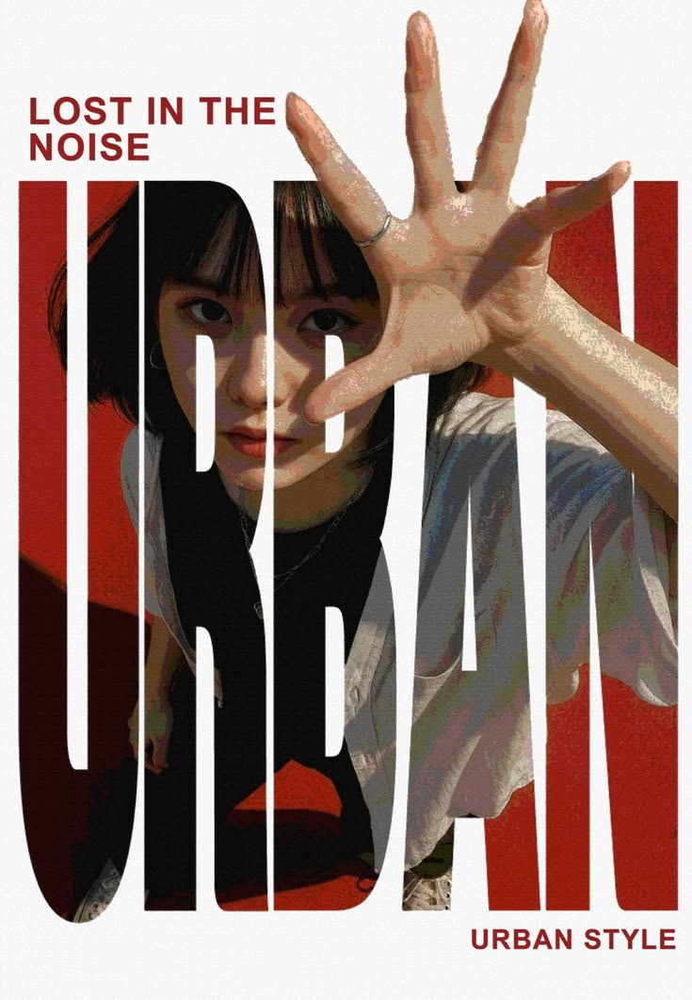

# 巨型字形中的都市人像重演

[← 返回画廊](../README.md)

**主体重演** · 保留主体身份，重演巨型字形、前伸手掌与红黑白都市海报。

插件内逆向后，调用 Codex imagegen 生成。

<table>
  <tr><th width="33%">图 1 · 主体原图</th><th width="33%">图 2 · 参考模板</th><th width="33%">生成结果</th></tr>
  <tr>
    <td valign="top"><a href="subject.png"></a></td>
    <td valign="top"><a href="reference.png"></a></td>
    <td valign="top"><a href="result.png"></a></td>
  </tr>
</table>

<details>
<summary>查看完整 Prompt（中文）</summary>

```text
以图1为人物身份来源，以图2为风格与结构模板，创作一张约7:10的纵向都市时尚海报。图1提供脸型、五官比例、蓝灰色眼睛、黑色长直发和轻薄刘海；图2提供版式、机位、整体动作、表情、服饰关系、遮挡、光影、配色与印刷表现。依据新姿态重新表现图1的身份特征。

让图1人物重演图2的低位蹲伏、身体前倾姿态：下部双腿弯曲分开，躯干向镜头靠近，肩胸随伸手动作前送；头部顺着前倾的躯干略低，面部朝向镜头，目光直接、神情沉静严肃，嘴唇自然合拢。从画面右侧向镜头伸出一只手，前臂连接右侧肩部，掌心朝向观者，五指充分张开，拇指斜向画面左下，其余手指向上和两侧展开。通过近大远小使手掌成为上半幅的主要前景，覆盖部分额头及脸侧，手指接近或触及画面上缘。脸位于手掌后方偏左，眼睛仍可从遮挡间辨认。长黑发随前倾动作落向肩胸及背后，保留长发身份，不改成模板的短发。服装采用图2的宽松浅灰短袖外层、黑色内搭和深色下装，辅以细银色项链和手指上的细银戒。

以略带细纸纹的近白色为整张海报底色。主体版面从约五分之一画高处开始，向下延伸至接近底部，以极粗、极度窄长的无衬线大写“URBAN”几乎铺满宽度。将人物与大片浓烈砖红背景嵌入这些巨型字母内部，保留清晰的白色字腔和狭长字间隙，让白色负形纵向切过脸部、胸腹和衣物。人物与文字共用同一构图，不能变成完整矩形照片加标题。前景手掌和相连前臂局部突破字形蒙版，向上覆盖白色留白、向右延伸，形成明确的前后层次；其余主要影像仍受字形边界裁切。左上留白内用深红色粗体无衬线文字分两行排“LOST IN THE”和“NOISE”，左对齐；右下白色页脚排一行“URBAN STYLE”，右对齐。

字形内部以砖红色铺开人物周围的背景，黑色头发、内搭和腿部组成深暗块面。面部处于较暗的暖棕与灰橄榄色阴影中，保留图1五官结构和低饱和蓝灰虹膜，不额外提亮成发光眼睛。近处掌心及前臂以暖米色、赭粉色和浅奶油色受光块面塑形，指根、掌纹及转折处落入棕褐和灰绿色阴影；亮度高于脸部。浅灰外衣沿褶皱分布冷蓝灰阴影、灰绿色中间调和少量暗粉反色，与暖色手掌形成对照。

整体采用摄影基础上的色阶压缩和复古印刷外观：皮肤以不规则细碎色斑和短促纹理形成明暗交界，仍保留手掌与脸部体积；衣料用较大的折面色块组织褶皱；黑发主要归并为暗面，仅留少量顺发向亮纹。红色区域带细微油墨颗粒，白色纸面纹理轻淡，字形裁切边缘保持利落。重点落实巨大字形负空间、近距离张开的手掌、较暗的可辨认面容和红黑白版式节奏。
```

</details>

<details>
<summary>排除项 / 生成约束</summary>

```text
沿用图1的侧身回望姿势和白衬衫棚拍构图，替换成图2人物的脸或短发，缩小前景手掌或取消透视，手指粘连或增生，整张矩形照片直接叠加普通标题，取消巨型字形蒙版与白色负空间，将全部人物完全限制在字形内而失去手部破框，蓝色发光眼睛，光滑塑料皮肤，厚重油画堆料，全幅粗裂纹，额外文案
```

</details>
