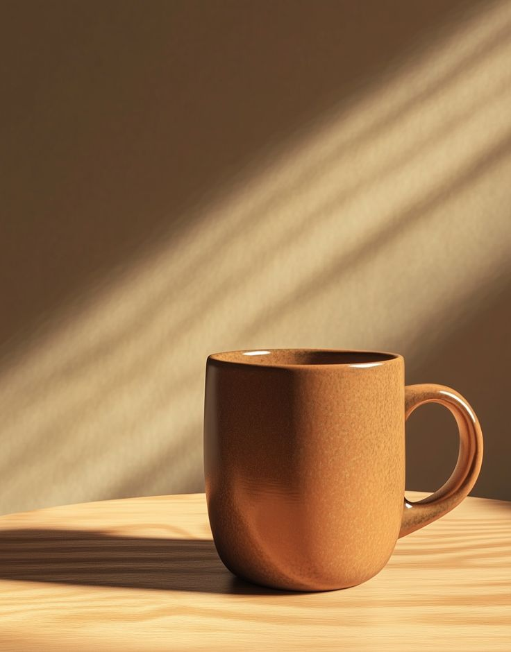
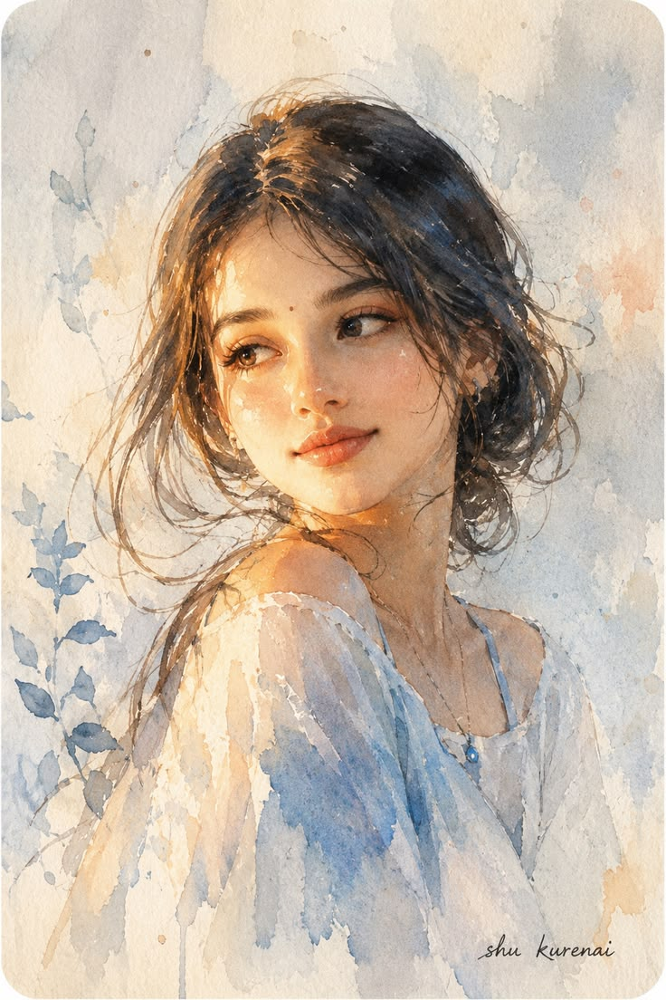

# 暖金蓝灰水彩陶瓷杯

[← 返回画廊](../README.md)

**提取风格** · 保留陶瓷杯的形状、视角和场景，将人物参考中的暖金蓝灰水彩迁移到产品图。

插件内逆向后，调用 Codex imagegen 生成。

<table>
  <tr><th width="33%">图 1 · 主体原图</th><th width="33%">图 2 · 参考模板</th><th width="33%">生成结果</th></tr>
  <tr>
    <td valign="top"><a href="subject.png"></a></td>
    <td valign="top"><a href="reference.png"></a></td>
    <td valign="top"><a href="result.png"></a></td>
  </tr>
</table>

<details>
<summary>查看完整 Prompt（中文）</summary>

```text
对两张输入图片进行保留结构的风格转换：图 1 是唯一的主体、物体几何、视角、构图、裁切、空间关系和背景结构来源；图 2 仅提供透明水彩叠染、暖金与蓝灰的冷暖关系、纸张颗粒及自然晕染边缘。将图 1 的静物照片完整重绘为水彩插画。

保持图 1 的竖幅比例与原有取景：一只棕橙色陶瓷杯位于画面下部偏右，上方是大片墙面，下方是木质桌面。保留杯身近直立的侧壁、圆润收拢的底部、可见的椭圆杯口与深色内壁，以及右侧环形把手的大小、弧度、连接位置和孔洞形状；保留孔洞中原本可见的背景。维持杯子占比、位置、桌面后缘的弧线、桌墙分界、木纹走向、杯底接触关系和向左延伸的投影。保留墙面从右上至左下的斜向明暗带及其位置、宽度和节奏，不改变光影构图。

分区域转译图 2 的画法：杯身仍以棕橙和赭色为主体色，右侧受光面用稀薄暖金色层叠染，左侧暗面在棕色底层上叠加克制的蓝灰冷色，沿曲面渐变塑造圆润体积，不把整只杯子改成蓝色。杯口内壁和把手内缘以较浓的棕灰、蓝灰叠层加深；原有杯沿与把手亮点用少量纸白和浅暖色留白表达，保持陶瓷釉面的光泽线索。透明仅指颜料色层，不改变陶瓷的不透明材质。

木桌受光处采用浅赭、蜂蜜金色薄洗，以顺着原有木纹方向的疏密细笔触概括纹理；左向投影用棕灰混合蓝灰的透明色层表现，杯底接触影较深且边界明确，远离接触处适度晕开，保持原投影轮廓和长度。墙面采用宽幅湿画法，原斜向亮带呈浅暖金与奶油色，原暗区转为低饱和蓝灰与暖灰棕的层叠；保留各明暗区的相对明度与覆盖范围，以水分扩散柔化局部交界，不把墙面替换成图 2 的装饰背景。

让纸张细颗粒在墙面浅洗、桌面亮部和杯身薄色层中自然透出，深色叠染区相对收敛。用少量积色、水痕和自然不规则的色层边缘体现水彩过程；杯口、把手孔洞和落地接触处保持必要的清晰度，晕染只改变局部笔触边缘，不改变杯子的整体几何。全画面以分区色层和笔触重新塑形，避免在照片上仅覆盖纸纹或统一调色。只保留图 1 已有物体，不加入图 2 的人物、植物、服装、饰品或背景内容，不加入其他道具、文字、签名、水印或圆角边框。
```

</details>

<details>
<summary>排除项 / 生成约束</summary>

```text
人物，植物，服装或首饰元素，新增道具，文字，签名，水印，圆角边框；改变杯子位置、比例、杯口或右侧把手几何，封闭把手孔洞，改变桌墙结构或斜向光影布局，杯底悬空；将陶瓷变成透明玻璃，将杯身整体改为蓝色；照片上叠加统一纸纹滤镜，厚重不透明堆色，全幅等强度颗粒，过度晕染导致轮廓与接触影消失
```

</details>

[参考模板所在的 Pinterest 页面](https://www.pinterest.com/pin/155585362123525407/)
