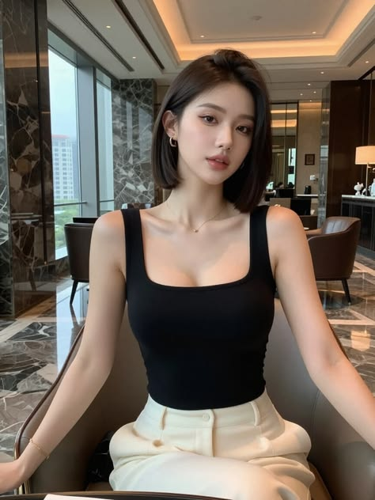

# 短发回眸暖金水彩肖像

[← 返回画廊](../README.md)

**主体重演** · 将短发主体融入暖金水彩模板，重演回眸姿态与光影。

插件内逆向后，调用 Codex imagegen 生成。

<table>
  <tr><th width="33%">图 1 · 主体原图</th><th width="33%">图 2 · 参考模板</th><th width="33%">生成结果</th></tr>
  <tr>
    <td valign="top"><a href="subject.png"></a></td>
    <td valign="top"><a href="reference.png"></a></td>
    <td valign="top"><a href="result.png"></a></td>
  </tr>
</table>

<details>
<summary>查看完整 Prompt（中文）</summary>

```text
以两张输入图完成单人半身水彩肖像的主体重演：图 1 仅提供人物身份、面部辨识特征与短发特征；图 2 提供半身回眸构图、肩颈姿态、视线与柔和神情、浅蓝服装、暖金照明、背景关系及透明水彩画法。保留图 1 人物的脸型、眉眼关系、鼻形和唇形，以及偏分深棕近黑短直发、下颌至颈侧的发长和略内收的齐整发尾。五官比例、面部投影与发丝遮挡随新视角自然重绘，不替换成图 2 人物的脸，也不复制图 2 的低束发。

采用图 2 约 2:3 的竖幅半身近景，头部位于画面上半部，肩胸与宽松衣料延伸至下缘，手与下半身不入画。整体重建回眸动作：躯干斜侧向画面右侧展开，画面左侧的近肩向前并略抬高，肩线倾斜；颈部自然承接肩胸，头相对躯干转向画面左侧，下颌轻轻靠近近肩，形成肩部托起面部的视觉关系。双眼视线共同指向画面左侧画外，嘴唇自然轻合、神情柔和安静。短发随转头在颈侧产生合理遮挡，边缘可有少量松散细发，保持短发整体轮廓。

替换为图 2 的浅蓝色宽松薄衣：宽领口从近肩滑落，露出肩部与锁骨，细蓝肩带可见；衣料以淡蓝、灰蓝透明叠色表现柔软垂坠，褶皱暗处加深冷蓝色，受光处保留大片温白纸色。颈前可见纤细项链与小蓝色坠饰，作为次要细节。

暖金光从画面左上方照来，在左侧发缘形成断续金棕亮线，并照亮额头、鼻梁、脸颊、唇缘和近肩。皮肤以透明蜜桃色和淡金色铺底，颊部、鼻尖与嘴唇叠入柔和珊瑚色，背光面以低饱和灰紫与暖褐薄层塑形，保留脸部辨识所需的五官结构。头发保持深棕近黑的大暗面，内部用少量冷灰蓝色层和顺发向细笔触区分体积，金光不把整头头发染成金色。

全画使用透明水彩的分区画法：面部色层细薄，眼睑、鼻翼与唇线有选择地清晰；衣服以宽松的湿画法、干笔断痕、叠色边缘和纸白表现；头发外缘以细线与融入背景的软边交替。纸纹细微贯穿画面，明显水痕、颜料沉积和不规则留白主要位于衣服及背景，避免把粗重斑驳均匀铺满皮肤。背景采用暖象牙纸底，叠加稀薄灰蓝与浅赭色水彩晕染，左下布置少量蓝灰植物枝叶剪影，衬托主体且不抢夺面部焦点。衣料下缘与部分外轮廓自然融入纸白。去除图 1 的原室内场景、座椅与正面坐姿；画面不含任何文字、签名或水印。
```

</details>

<details>
<summary>排除项 / 生成约束</summary>

```text
图 1 的正面室内坐姿、直视镜头、原座椅与室内背景、黑色背心与米白下装；图 2 的人物面容替代图 1 身份、低发髻、长发；头颈与肩胸转向脱节；仅在原照片上叠加水彩滤镜、厚重不透明颜料堆积、皮肤均匀粗重斑驳、整头金发；文字、签名、水印。
```

</details>

[参考模板所在的 Pinterest 页面](https://www.pinterest.com/pin/155585362123525407/)
